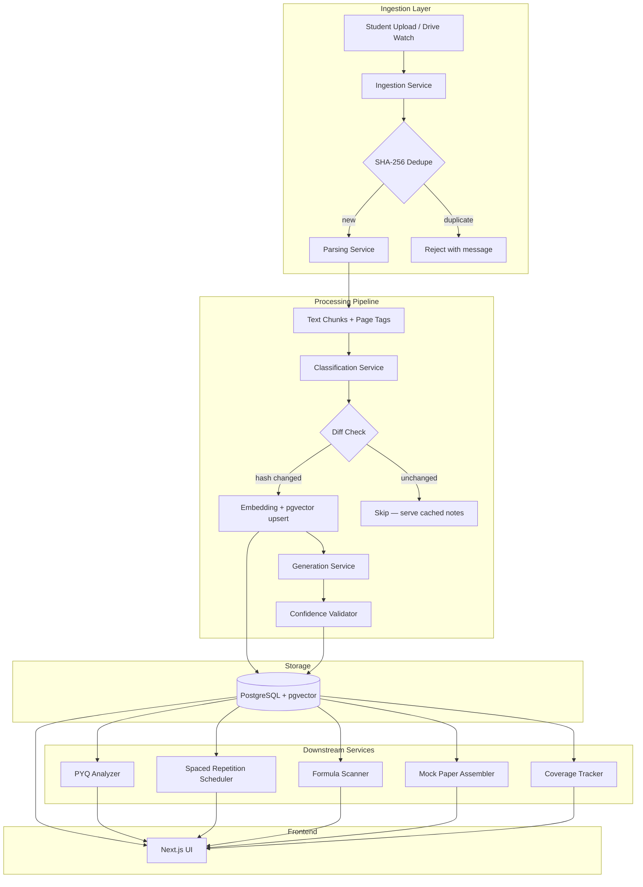
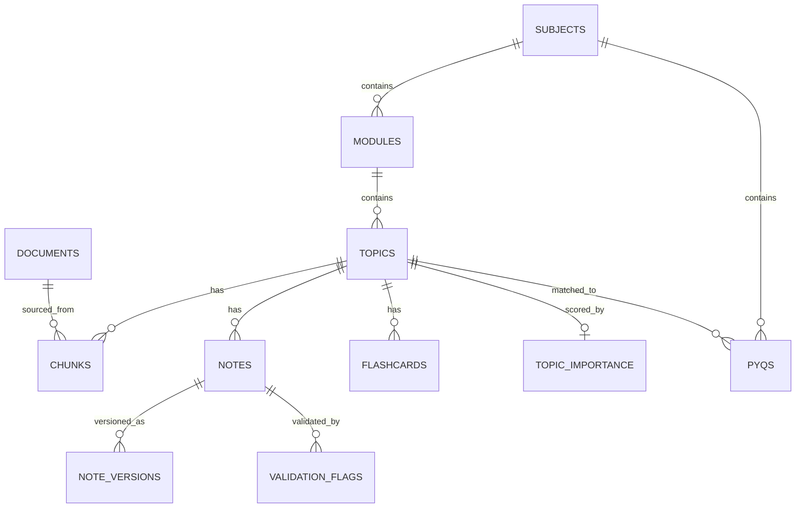
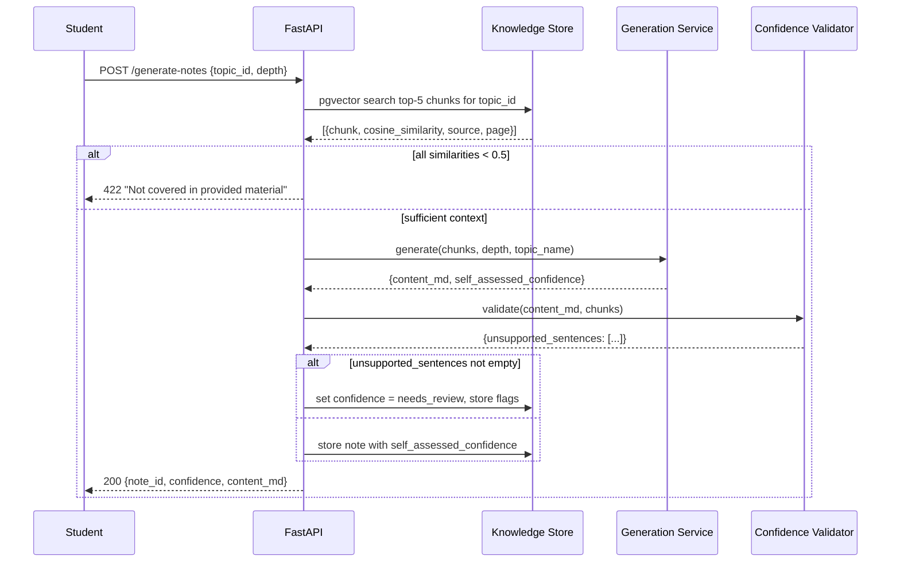
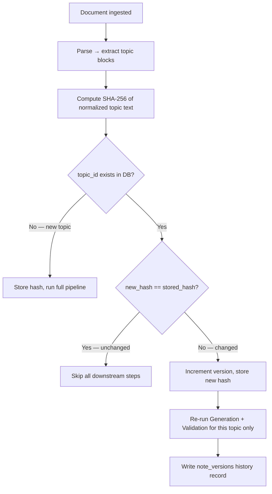
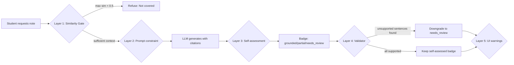

# Design Document — Tattva Exam Engine

## Overview

Tattva is an AI-powered exam preparation platform for engineering students. It ingests lecture PDFs, parses and classifies their content into a subject/module/topic taxonomy, generates RAG-grounded study notes at three exam depths (2-mark, 6-mark, 10-mark), tracks Previous Year Question (PYQ) frequency, and surfaces everything through a dark-themed Next.js web UI.

The core architectural constraint is **citation-or-refuse**: every generated claim must trace back to a specific page in a student's uploaded PDF. The system never fills knowledge gaps from LLM training data. This single rule separates Tattva from generic summarization tools and makes it safe for exam preparation.

### Design Goals

1. **Correctness over completeness** — a "Not covered in provided material" response is always preferable to a hallucinated answer.
2. **Cost efficiency** — the content-hash incremental diff pipeline ensures the LLM is only called when source material actually changes.
3. **Traceability** — every chunk, note, and flashcard carries its source document ID and page number from ingestion to display.
4. **Modularity** — the five core services (Ingestion, Parsing, Classification, Knowledge Store, Generation) are independently deployable and testable.

---

## Architecture

### System Overview



### Service Decomposition

Tattva is composed of **five primary services** and **four secondary services**. All services communicate through the FastAPI backend; the frontend exclusively interacts with FastAPI endpoints.

| Service | Responsibility | Phase |
|---|---|---|
| Ingestion Service | File receipt, SHA-256 hashing, deduplication, Drive OAuth polling | 1 / 2 |
| Parsing Service | PyMuPDF extraction, OCR fallback, chunking, page tagging | 1 |
| Classification Service | LLM taxonomy mapping, new topic creation, confidence flagging | 1 |
| Knowledge Store | PostgreSQL + pgvector CRUD, semantic search, version history | 1 |
| Generation Service | RAG-grounded note generation, confidence self-assessment, diagram/flashcard/formula generation | 1 |
| Confidence Validator | Second-pass hallucination detection, badge downgrade | 1 |
| PYQ Analyzer | PYQ ingestion, LLM topic matching, deterministic SQL frequency scoring | 3 |
| Mock Paper Assembler | PYQ-weighted paper selection | 3 |
| Spaced Repetition Scheduler | SM-2 flashcard scheduling | 3 |
| Coverage Tracker | Badge aggregation, coverage percentage computation | 3 |

### Technology Choices and Rationale

| Layer | Technology | Rationale |
|---|---|---|
| Backend API | FastAPI (Python) | Async support, consistent with existing project stack (VORTEX/PRISM) |
| Database | PostgreSQL 15+ | ACID transactions for version history; well-understood at scale |
| Vector Store | pgvector extension | Co-located with relational data; avoids separate vector DB operational burden |
| PDF Parsing | PyMuPDF (primary), pdfplumber, Tesseract OCR (fallback) | PyMuPDF is fastest for text-native PDFs; OCR only for image-only pages to control cost |
| LLM — Generation | Gemini API (large model) | Student's existing API access; strong context window for 10-mark notes |
| LLM — Classification/PYQ | Gemini Flash or equivalent cheaper model | Classification and PYQ matching do not require top-tier reasoning; cost lever |
| Embedding | Gemini Embeddings (1536-dim) or text-embedding-004 | Matches pgvector column dimension; batch-friendly |
| Frontend | Next.js 14, Tailwind CSS, shadcn/ui | Specified in requirements; App Router for RSC; shadcn for accessible components |
| Scheduler | APScheduler (Phase 1 MVP), Celery + Redis (Phase 2+) | APScheduler is zero-dependency for MVP; Celery for reliable background job queuing |
| Diagram Rendering | Mermaid.js (client-side) | Structured text output from LLM is far more reliable than raw SVG generation |
| Formula Rendering | KaTeX (client-side) | Fast, accurate LaTeX rendering in browser |

---

## Components and Interfaces

### A. Ingestion Service

**Responsibilities:** Accept PDF uploads (manual or Drive-triggered), validate, deduplicate, persist raw file metadata, enqueue downstream processing.

**Key design decisions:**
- SHA-256 is computed over the raw file bytes (before any parsing) for deduplication. This is fast and deterministic.
- Subject association is optional at upload time; classification can assign it later.
- Drive integration uses OAuth2 push notifications (watch channels) with a polling fallback at a configurable interval (default 5 min, range 1–60 min).
- Retry logic for Drive downloads: 3 attempts at 60-second intervals before marking as failed.

**API Interface:**

```
POST /ingest
  Body: multipart/form-data { file: PDF, subject_id?: UUID }
  Response 200: { document_id: UUID }
  Response 400: { error: "file_type_invalid" | "file_size_exceeded" }
  Response 409: { error: "duplicate_content", existing_document_id: UUID }

GET /documents
  Response 200: { documents: [{ id, filename, uploaded_at, subject_id, source_type, confidence_summary }] }

DELETE /documents/{document_id}
  Response 204
```

### B. Parsing Service

**Responsibilities:** Extract text, headings, formulas, tables, figures from PDFs. Produce token-bounded chunks with page attribution. Store to Knowledge Store.

**Key design decisions:**
- PyMuPDF is run first on every page. If a page yields zero characters of text, Tesseract OCR is applied as a fallback — not before. This avoids expensive OCR on text-native PDFs.
- Chunks are sized to 400–600 tokens using a sliding-window splitter that respects sentence boundaries.
- Every chunk carries `{ document_id, page_number, text, token_count }` — page_number is never nullable.
- Pages that yield no text after both extraction methods are logged as unprocessable (`{ document_id, page_number, reason: "no_text_extracted" }`) and processing continues on the remaining pages.

**Chunk splitting algorithm:**
1. Split page text into sentences using a lightweight sentence tokenizer (e.g., NLTK Punkt or spaCy).
2. Accumulate sentences into a chunk until token count would exceed 600.
3. If a single sentence exceeds 600 tokens, hard-split at 600 with a `[truncated]` marker.
4. Minimum chunk size is 400 tokens; if the final chunk of a page is below 400, it is merged with the previous chunk.

### C. Classification Service

**Responsibilities:** Map parsed document content to the subject/module/topic taxonomy. Create new taxonomy records when no match exists. Flag low-confidence results for review.

**Key design decisions:**
- Classification uses the LLM prompt defined in `C1` (Tattva_Master_Build_Spec.md §C1). The prompt is the sole interface; output must be JSON conforming to the defined schema.
- A single retry is performed on LLM error or JSON parse failure. If both attempts fail, the document is marked `classification_failed` and halted.
- New subject/module/topic records are written to the Knowledge Store **before** the document proceeds to chunking, so foreign key constraints are satisfied.
- Low-confidence (`"low"`) classifications include a mandatory `note` field (max 200 chars) and set a `pending_review` flag on the classification record.

**Classification output schema:**
```json
{
  "subject": "string",
  "module_number": 1,
  "topic": "string",
  "is_new_topic": true,
  "confidence": "high | medium | low",
  "note": "string (optional, max 200 chars)"
}
```

### D. Knowledge Store

**Responsibilities:** Persist all data entities. Serve semantic search over chunk embeddings. Enforce uniqueness constraints.

**Key design decisions:**
- pgvector cosine similarity search is the primary retrieval mechanism. The `chunks.embedding` column is indexed with `ivfflat` (lists=100) for query performance.
- Top-k search results always include `source_filename` and `page_number` — these are never stripped from query results.
- The default value of k is 5 when not specified by the caller.
- Version history is immutable: notes are never overwritten; a new `version` record is inserted on each regeneration.

**Search endpoint:**
```
GET /search?q=<text>&topic_id=<UUID>&k=<integer>
  Response 200: {
    results: [{
      chunk_id, text, cosine_similarity,
      source_filename, page_number,
      subject_id, module_id, topic_id
    }]
  }
  Response 500: { error: "search_failed", detail: string }
```

### E. Generation Service

**Responsibilities:** RAG-grounded note generation at three depths. Confidence self-assessment. Diagram, flashcard, and formula generation. Invokes Confidence Validator after each note.

**Key design decisions:**
- The generation prompt (`C2`) is the only LLM interface for note generation. The prompt explicitly forbids facts from training data.
- If the maximum cosine similarity across all top-5 chunks is below 0.5, the service returns `"Not covered in provided material"` and writes no note record.
- The self-assessed confidence badge is parsed from the last line of LLM output (`CONFIDENCE: grounded|partial|needs_review`) and stored as-is; the Confidence Validator may downgrade it.
- Diagram generation (`C3`) is a post-processing step; its failure never blocks note storage (logged, diagram field left null).

**API Interface:**
```
POST /generate-notes
  Body: { topic_id: UUID, depth: "2mark" | "6mark" | "10mark" }
  Response 200: { note_id: UUID, confidence: string, content_md: string }
  Response 400: { error: "invalid_topic_id" | "invalid_depth" }
  Response 422: { error: "coverage_insufficient", detail: "Not covered in provided material" }
  Response 500: { error: "generation_failed", topic_id: UUID, reason: string }
```

### F. Confidence Validator

**Responsibilities:** Second-pass review of generated notes against cited chunks. Flag unsupported sentences. Downgrade confidence badge when unsupported content is detected.

**Key design decisions:**
- Uses prompt `C8` (Master Build Spec) with a cheaper/faster model — this call must complete within 30 seconds.
- The validator is **read-only with respect to note content**. It may only modify the `confidence` field on the note record and append log entries.
- If the validator itself fails (LLM error, timeout), the existing confidence badge is preserved unchanged and the failure is logged with the note_id.
- Unsupported sentences are stored in a `validation_flags` table (not embedded in the note content) for review.

### G. PYQ Analyzer

**Responsibilities:** Ingest past year question papers. Match questions to taxonomy topics via LLM. Compute topic importance via deterministic SQL.

**Key design decisions:**
- Frequency counting is a deterministic `COUNT(*) GROUP BY topic_id` — never delegated to an LLM. This is non-negotiable to prevent hallucinated frequency scores.
- Difficulty estimation is LLM-assisted (prompt `C5`) but stored per-PYQ for audit. The importance score is computed only from SQL aggregation.
- Unmatched PYQs (null `topic_id`) are preserved in the table and surfaced in the UI for manual review.
- Recalculation of all importance scores must complete within 10 seconds for up to 500 PYQs (straightforward for a SQL GROUP BY).

**Importance computation:**
```sql
INSERT INTO topic_importance (topic_id, frequency_count, difficulty_avg, last_recalculated)
SELECT
    topic_id,
    COUNT(*) AS frequency_count,
    AVG(CASE difficulty WHEN 'easy' THEN 1 WHEN 'medium' THEN 2 WHEN 'hard' THEN 3 END) AS difficulty_avg,
    NOW()
FROM pyqs
WHERE topic_id IS NOT NULL
GROUP BY topic_id
ON CONFLICT (topic_id) DO UPDATE
SET frequency_count = EXCLUDED.frequency_count,
    difficulty_avg = EXCLUDED.difficulty_avg,
    last_recalculated = EXCLUDED.last_recalculated;
```

### H. Spaced Repetition Scheduler

**Responsibilities:** Implement SM-2 algorithm for flashcard review scheduling. Validate recall scores. Update per-card state after each review.

**SM-2 Algorithm Implementation:**

For a review with recall score `q` (0–5):

```python
def update_sm2(ease_factor: float, interval: int, repetitions: int, q: int) -> dict:
    """
    SM-2 algorithm update.
    ease_factor: current EF (initial = 2.5)
    interval: current interval in days (initial = 1)
    repetitions: number of successful reviews (initial = 0)
    q: recall quality 0-5
    """
    if q < 3:  # Failed recall — restart
        repetitions = 0
        interval = 1
    else:
        if repetitions == 0:
            interval = 1
        elif repetitions == 1:
            interval = 6
        else:
            interval = round(interval * ease_factor)
        repetitions += 1

    new_ef = ease_factor + (0.1 - (5 - q) * (0.08 + (5 - q) * 0.02))
    new_ef = max(1.3, new_ef)  # EF floor

    next_review = datetime.utcnow() + timedelta(days=interval)
    return {
        "ease_factor": new_ef,
        "interval": interval,
        "repetitions": repetitions,
        "next_review_at": next_review
    }
```

The SM-2 update function is a **pure function** — it has no side effects and is ideal for property-based testing.

---

## Data Models

### PostgreSQL Schema

```sql
-- Core taxonomy
CREATE TABLE subjects (
    id          UUID PRIMARY KEY DEFAULT gen_random_uuid(),
    name        VARCHAR(120) NOT NULL,
    code        VARCHAR(10) NOT NULL UNIQUE CHECK (code ~ '^[A-Za-z0-9]{4,10}$'),
    created_at  TIMESTAMPTZ NOT NULL DEFAULT NOW()
);

CREATE TABLE modules (
    id          UUID PRIMARY KEY DEFAULT gen_random_uuid(),
    subject_id  UUID NOT NULL REFERENCES subjects(id) ON DELETE CASCADE,
    number      INTEGER NOT NULL,
    title       VARCHAR(255) NOT NULL,
    UNIQUE (subject_id, number)
);

CREATE TABLE topics (
    id              UUID PRIMARY KEY DEFAULT gen_random_uuid(),
    module_id       UUID NOT NULL REFERENCES modules(id) ON DELETE CASCADE,
    name            VARCHAR(255) NOT NULL,
    content_hash    CHAR(64),           -- SHA-256 of normalized topic text
    version         INTEGER NOT NULL DEFAULT 1,
    last_updated    TIMESTAMPTZ NOT NULL DEFAULT NOW(),
    pending_review  BOOLEAN NOT NULL DEFAULT FALSE
);

-- Document ingestion
CREATE TABLE documents (
    id              UUID PRIMARY KEY DEFAULT gen_random_uuid(),
    subject_id      UUID REFERENCES subjects(id),  -- nullable: classified later
    source_type     VARCHAR(20) NOT NULL CHECK (source_type IN ('manual', 'drive', 'classroom')),
    source_id       VARCHAR(255),       -- Drive file ID if applicable
    filename        VARCHAR(500) NOT NULL,
    uploaded_at     TIMESTAMPTZ NOT NULL DEFAULT NOW(),
    content_hash    CHAR(64) NOT NULL,
    status          VARCHAR(30) NOT NULL DEFAULT 'pending'
                    CHECK (status IN ('pending','parsing','classified','classification_failed','ready','error'))
);

-- Chunks (core retrieval unit)
CREATE EXTENSION IF NOT EXISTS vector;

CREATE TABLE chunks (
    id              UUID PRIMARY KEY DEFAULT gen_random_uuid(),
    topic_id        UUID REFERENCES topics(id),
    document_id     UUID NOT NULL REFERENCES documents(id) ON DELETE CASCADE,
    page_number     INTEGER NOT NULL CHECK (page_number >= 1),
    text            TEXT NOT NULL,
    token_count     INTEGER NOT NULL CHECK (token_count >= 1),
    embedding       vector(1536),
    created_at      TIMESTAMPTZ NOT NULL DEFAULT NOW()
);

CREATE INDEX ON chunks USING ivfflat (embedding vector_cosine_ops) WITH (lists = 100);
CREATE INDEX ON chunks (topic_id);
CREATE INDEX ON chunks (document_id);

-- Generated notes
CREATE TABLE notes (
    id              UUID PRIMARY KEY DEFAULT gen_random_uuid(),
    topic_id        UUID NOT NULL REFERENCES topics(id) ON DELETE CASCADE,
    version         INTEGER NOT NULL DEFAULT 1,
    depth           VARCHAR(10) NOT NULL CHECK (depth IN ('2mark', '6mark', '10mark')),
    content_md      TEXT NOT NULL,
    confidence      VARCHAR(20) NOT NULL CHECK (confidence IN ('grounded', 'partial', 'needs_review')),
    generated_at    TIMESTAMPTZ NOT NULL DEFAULT NOW(),
    mermaid_code    TEXT,               -- nullable: generated post-note, Phase 4
    audio_cache_key VARCHAR(500)        -- nullable: TTS cache, Phase 4
);

CREATE INDEX ON notes (topic_id, depth, version);

-- Note version history (immutable: never delete rows here)
CREATE TABLE note_versions (
    id              UUID PRIMARY KEY DEFAULT gen_random_uuid(),
    note_id         UUID NOT NULL REFERENCES notes(id),
    topic_id        UUID NOT NULL,
    version         INTEGER NOT NULL,
    content_md      TEXT NOT NULL,
    confidence      VARCHAR(20) NOT NULL,
    generated_at    TIMESTAMPTZ NOT NULL,
    source_document_id UUID REFERENCES documents(id),
    created_at      TIMESTAMPTZ NOT NULL DEFAULT NOW()
);

-- Validation flags (from Confidence Validator)
CREATE TABLE validation_flags (
    id              UUID PRIMARY KEY DEFAULT gen_random_uuid(),
    note_id         UUID NOT NULL REFERENCES notes(id),
    flagged_sentence TEXT NOT NULL,
    flagged_at      TIMESTAMPTZ NOT NULL DEFAULT NOW()
);

-- PYQ tables
CREATE TABLE pyqs (
    id              UUID PRIMARY KEY DEFAULT gen_random_uuid(),
    subject_id      UUID NOT NULL REFERENCES subjects(id),
    year            INTEGER NOT NULL CHECK (year BETWEEN 2000 AND 2100),
    question_text   TEXT NOT NULL CHECK (char_length(question_text) BETWEEN 10 AND 2000),
    topic_id        UUID REFERENCES topics(id),   -- null if unmatched
    marks           INTEGER NOT NULL CHECK (marks BETWEEN 1 AND 100),
    difficulty      VARCHAR(10) CHECK (difficulty IN ('easy', 'medium', 'hard')),
    difficulty_note VARCHAR(200),
    secondary_topics UUID[],
    is_unmatched    BOOLEAN NOT NULL DEFAULT FALSE,
    created_at      TIMESTAMPTZ NOT NULL DEFAULT NOW()
);

CREATE TABLE topic_importance (
    topic_id            UUID PRIMARY KEY REFERENCES topics(id) ON DELETE CASCADE,
    frequency_count     INTEGER NOT NULL DEFAULT 0,
    difficulty_avg      NUMERIC(4,2),
    last_recalculated   TIMESTAMPTZ
);

-- Flashcards
CREATE TABLE flashcards (
    id              UUID PRIMARY KEY DEFAULT gen_random_uuid(),
    topic_id        UUID NOT NULL REFERENCES topics(id) ON DELETE CASCADE,
    note_id         UUID REFERENCES notes(id),
    question        TEXT NOT NULL,
    answer          TEXT NOT NULL CHECK (char_length(answer) <= 300),
    source          VARCHAR(500),                   -- "filename.pdf, p.N"
    ease_factor     NUMERIC(4,2) NOT NULL DEFAULT 2.5 CHECK (ease_factor >= 1.3),
    interval_days   INTEGER NOT NULL DEFAULT 1,
    repetitions     INTEGER NOT NULL DEFAULT 0,
    next_review_at  TIMESTAMPTZ NOT NULL DEFAULT NOW(),
    created_at      TIMESTAMPTZ NOT NULL DEFAULT NOW()
);

CREATE INDEX ON flashcards (topic_id);
CREATE INDEX ON flashcards (next_review_at);

-- Classification records
CREATE TABLE classifications (
    id              UUID PRIMARY KEY DEFAULT gen_random_uuid(),
    document_id     UUID NOT NULL REFERENCES documents(id),
    subject         VARCHAR(255),
    module_number   INTEGER,
    topic           VARCHAR(255),
    is_new_topic    BOOLEAN NOT NULL DEFAULT FALSE,
    confidence      VARCHAR(10) NOT NULL CHECK (confidence IN ('high', 'medium', 'low')),
    note            VARCHAR(200),
    pending_review  BOOLEAN NOT NULL DEFAULT FALSE,
    created_at      TIMESTAMPTZ NOT NULL DEFAULT NOW()
);

-- OAuth tokens (Drive integration, Phase 2)
CREATE TABLE oauth_tokens (
    id              UUID PRIMARY KEY DEFAULT gen_random_uuid(),
    user_id         UUID NOT NULL,
    provider        VARCHAR(30) NOT NULL DEFAULT 'google',
    access_token    TEXT NOT NULL,          -- store encrypted in production
    refresh_token   TEXT NOT NULL,
    scope           TEXT NOT NULL,
    expires_at      TIMESTAMPTZ NOT NULL,
    created_at      TIMESTAMPTZ NOT NULL DEFAULT NOW(),
    UNIQUE (user_id, provider)
);
```

### Entity Relationship Summary



---

## RAG Pipeline

### Pipeline Flow



### Retrieval Strategy

1. **Topic-scoped retrieval**: The pgvector search is filtered to `WHERE topic_id = :topic_id` to avoid cross-topic contamination. The query embedding is generated from the topic name + module context string.
2. **Similarity threshold gate**: Before generation, the maximum cosine similarity across all returned chunks is checked. If `max(similarities) < 0.5`, generation is refused.
3. **Chunk context assembly**: Retrieved chunks are assembled into the prompt in descending similarity order, each prefixed with `[Source: {filename}, p.{page_number}]`.

### Generation Prompt Strategy (Depth-Tiered)

| Depth | Output Target | Key Constraints |
|---|---|---|
| `2mark` | 2–4 sentences | Crisp definition; one citation |
| `6mark` | 3–5 paragraphs | Definition + explanation + example/diagram reference; citation per paragraph |
| `10mark` | 6–10 paragraphs | Full structure: definition, 3+ sub-points, worked example, diagram reference, advantages/comparison; citation per paragraph |

Every depth level uses the same base prompt (`C2` from Master Build Spec) with the `{{depth}}` placeholder filled appropriately.

---

## Incremental Diff Strategy

### Hash-Based Change Detection



### Rules

- **Text normalization before hashing**: Strip leading/trailing whitespace, collapse internal whitespace sequences to single spaces, normalize Unicode to NFC. This prevents hash mismatches from invisible formatting changes.
- **Topic-level granularity**: Hashing is per classified topic block, not per document. A 10-module PDF will not trigger regeneration for modules 1–9 when only module 10 changes.
- **Version immutability**: `note_versions` rows are never deleted or updated. The `notes` table always reflects the current version; `note_versions` preserves all historical versions. Minimum 10 historical versions are retained per topic.
- **Manual override**: A `force_regenerate=true` flag on `POST /generate-notes` bypasses hash comparison and runs the full pipeline unconditionally.
- **Version history logging**: Every regeneration writes a `note_versions` record with `version`, `timestamp`, and `source_document_id`. If this write fails, the regeneration is aborted (transactional guarantee).

---

## Anti-Hallucination Mechanisms

Tattva employs a layered defense against LLM hallucination. Each layer is independent; failure of one does not disable the others.

### Layer 1 — Retrieval Gate

Before any generation call, the system checks: `if max(cosine_similarity for chunk in top_5) < 0.5: refuse`. No LLM call is made. The student sees "Not covered in provided material." This is the cheapest and most reliable guard.

### Layer 2 — Prompt Constraint (C2)

The generation prompt contains explicit instructions:
- "Use ONLY the retrieved context below — do not add facts from your own training data."
- "If the context doesn't cover something needed at this depth, say 'Not covered in provided material' instead of filling the gap."
- "For every paragraph, append a citation in the form: (Source: {filename}, p.{page_number})"

### Layer 3 — Self-Assessment Badge (C2 tail)

The model is instructed to output a `CONFIDENCE:` line at the end of the note body:
- `grounded` — every claim directly cited and supported
- `partial` — some claims inferred or combined across chunks but source-consistent
- `needs_review` — context was thin, ambiguous, or any claim appears unsupported

### Layer 4 — Confidence Validator (C8)

A second, independent LLM call reviews the generated note against its cited chunks. Any sentence whose cosine similarity against all cited chunks is below 0.5 is flagged as unsupported. If any sentence is flagged, the note's confidence badge is unconditionally downgraded to `needs_review` regardless of the self-assessed value.

### Layer 5 — UI Warning Indicators

Notes with `needs_review` confidence:
- Display a distinct amber border and warning icon in the note card.
- Show "Verified Sources: none available" in the sources panel.
- Are clearly visually differentiated from `grounded` notes throughout the UI.

### Hallucination Prevention Summary



---

## API Design

### Complete Endpoint Reference

#### Ingestion

| Method | Path | Purpose |
|---|---|---|
| `POST` | `/ingest` | Upload a PDF |
| `GET` | `/documents` | List all documents |
| `DELETE` | `/documents/{id}` | Remove a document |
| `POST` | `/oauth/google/connect` | Initiate Google OAuth2 flow (Phase 2) |
| `GET` | `/oauth/google/callback` | OAuth2 callback handler (Phase 2) |
| `POST` | `/drive/watch` | Register Drive push notification channel (Phase 2) |

#### Knowledge Store

| Method | Path | Purpose |
|---|---|---|
| `POST` | `/subjects` | Create a subject |
| `GET` | `/subjects` | List all subjects |
| `POST` | `/subjects/{id}/modules` | Create a module |
| `GET` | `/subjects/{id}/modules` | List modules for a subject |
| `GET` | `/topics/{topic_id}` | Get topic details |
| `GET` | `/search` | Semantic chunk search (`?q=&k=&topic_id=`) |

#### Generation

| Method | Path | Purpose |
|---|---|---|
| `POST` | `/generate-notes` | Generate note for topic + depth |
| `GET` | `/notes/{topic_id}` | Get all notes for a topic |
| `POST` | `/topics/{id}/regenerate` | Force regenerate (bypasses hash) |
| `GET` | `/coverage` | Coverage stats for dashboard |

#### PYQ & Mock Paper

| Method | Path | Purpose |
|---|---|---|
| `POST` | `/pyqs` | Ingest a PYQ |
| `GET` | `/pyqs` | List PYQs with filters |
| `POST` | `/pyqs/recalculate` | Trigger importance recalculation |
| `GET` | `/topics/{id}/importance` | Get topic importance score |
| `POST` | `/mock-paper` | Assemble a mock exam paper |

#### Flashcards

| Method | Path | Purpose |
|---|---|---|
| `GET` | `/flashcards` | List flashcards (`?topic_id=&due_only=`) |
| `POST` | `/flashcards/{id}/review` | Submit recall score, update SM-2 state |
| `GET` | `/flashcards/export/anki` | Download Anki-compatible CSV (Phase 4) |

#### Formula & Export

| Method | Path | Purpose |
|---|---|---|
| `GET` | `/formulas/{subject_id}` | Get formula sheet |
| `POST` | `/formulas/{subject_id}/scan` | Re-scan for formulas |
| `GET` | `/formulas/{subject_id}/export` | Download formula .md file |
| `POST` | `/export/notes` | Export notes as Markdown (Phase 4) |
| `POST` | `/export/notion` | Export to Notion (Phase 4) |

---

## Correctness Properties

*A property is a characteristic or behavior that should hold true across all valid executions of a system — essentially, a formal statement about what the system should do. Properties serve as the bridge between human-readable specifications and machine-verifiable correctness guarantees.*

This feature includes significant business logic (input validation, hashing, SM-2 algorithm, confidence badge rules, retrieval thresholds, coverage computation) that varies meaningfully with input and is well-suited for property-based testing. The following properties are derived from the prework analysis of all acceptance criteria.

**PBT Library:** `hypothesis` (Python) for backend properties; `fast-check` (TypeScript) for frontend properties where applicable.

---

### Property 1: File validation acceptance predicate

*For any* submitted file, the Ingestion Service's accept/reject decision must equal `(content_type == "application/pdf") AND (size_bytes <= 52_428_800)`. No other combination of inputs should produce a different decision.

**Validates: Requirements 1.1, 1.2**

---

### Property 2: SHA-256 deduplication is idempotent

*For any* valid PDF file, uploading the same file bytes twice must result in exactly one document record in the Knowledge Store. The second upload must return a `409 Conflict` response referencing the existing document ID.

**Validates: Requirements 1.4, 2.4**

---

### Property 3: Successful upload always returns a document ID

*For any* valid PDF file that passes size and type validation and is not a duplicate, the upload response must contain a non-null, non-empty `document_id` field of UUID format.

**Validates: Requirements 1.5**

---

### Property 4: Content hash is deterministic (SHA-256 round-trip)

*For any* PDF file with known byte content, the `content_hash` stored in the document record must equal the SHA-256 hex digest computed independently from the same byte sequence. Computing the hash twice on the same content must always produce the same result.

**Validates: Requirements 1.3, 5.1**

---

### Property 5: Every extracted chunk has a valid page number

*For any* PDF document with N pages, every chunk produced by the parser must have a `page_number` field in the integer range `[1, N]`. No chunk may have a null, zero, or out-of-range page number.

**Validates: Requirements 3.3, 3.6**

---

### Property 6: Chunk token counts are within bounds

*For any* PDF document parsed by the system, every chunk stored in the Knowledge Store must have a `token_count` in the range `[400, 600]`, with the exception of the final chunk of a page which may be between 1 and 600 tokens (merged with the previous when below 400).

**Validates: Requirements 3.4**

---

### Property 7: Classification output always conforms to schema

*For any* parsed document submitted to the Classifier, the output JSON must contain all required fields (`subject`, `module_number`, `topic`, `is_new_topic`, `confidence`, and optionally `note`) with the correct types, and `confidence` must be one of `{"high", "medium", "low"}`.

**Validates: Requirements 4.1, 4.6**

---

### Property 8: Low-confidence classification note is bounded

*For any* classification result where `confidence == "low"`, the `note` field must be present, non-empty, and have `len(note) <= 200` characters.

**Validates: Requirements 4.5**

---

### Property 9: Unchanged topic hash causes no downstream processing

*For any* document that has been previously ingested, re-ingesting the identical byte content (same SHA-256 hash per topic block) must not trigger any calls to the Generation Service. The stored note records and version numbers must remain unchanged after the second ingestion.

**Validates: Requirements 5.2**

---

### Property 10: Changed topic hash triggers version increment

*For any* topic that has been previously ingested, re-ingesting modified content (different SHA-256 hash) must result in the topic's `version` field incrementing by exactly 1, a new `content_hash` being stored, and a new `note_versions` record being created.

**Validates: Requirements 5.4, 5.6**

---

### Property 11: Version history is monotonically growing

*For any* topic, after N sequential content changes (N >= 2), the `note_versions` table must contain at least N historical records for that `topic_id`, ordered by `created_at` ascending, with strictly increasing version numbers.

**Validates: Requirements 5.5**

---

### Property 12: Every stored chunk carries all five required tags

*For any* chunk written to the Knowledge Store, the fields `subject_id`, `module_id`, `topic_id`, `document_id`, and `page_number` must all be non-null.

**Validates: Requirements 6.3**

---

### Property 13: Semantic search results are correctly ordered and attributed

*For any* search query with a specified `k`, all returned results must: (a) have a `cosine_similarity` in the range `(0, 1]`, (b) be sorted by `cosine_similarity` in descending order, (c) each include `source_filename` and `page_number` as non-null fields, and (d) number at most `k` results.

**Validates: Requirements 6.4**

---

### Property 14: Subject code uniqueness invariant

*For any* subject code submitted via the "Add Subject" form, a second submission with the same code must be rejected with an error indicating the duplicate, and the `subjects` table must still contain exactly one record with that code.

**Validates: Requirements 6.6**

---

### Property 15: Low-retrieval-similarity triggers refusal, not generation

*For any* `topic_id` where the maximum cosine similarity across the top-5 retrieved chunks is below 0.5, the Generation Service must return "Not covered in provided material" and must not write any record to the `notes` table.

**Validates: Requirements 7.7, 8.6**

---

### Property 16: Every generated note paragraph contains a citation

*For any* successfully generated note at any depth, splitting the note content by paragraph boundaries must yield at least one paragraph, and every paragraph must match the citation pattern `(Source: <filename>, p.<integer>)`.

**Validates: Requirements 7.5**

---

### Property 17: Generated note confidence badge is always a valid value

*For any* note stored in the `notes` table, the `confidence` field must be one of `{"grounded", "partial", "needs_review"}`. No other value is permitted.

**Validates: Requirements 7.8**

---

### Property 18: Confidence Validator only downgrades, never upgrades

*For any* note that enters the Confidence Validator with a confidence badge B, the note's confidence badge after validation must be either equal to B (unchanged) or `"needs_review"` (downgraded). The validator must never produce a badge with higher confidence than the input badge.

**Validates: Requirements 8.3**

---

### Property 19: Confidence Validator does not mutate note content

*For any* note, the SHA-256 hash of `content_md` before the Confidence Validator runs must equal the SHA-256 hash of `content_md` after the Confidence Validator runs.

**Validates: Requirements 8.7**

---

### Property 20: Coverage percentage matches formula

*For any* set of topics with known badge distributions, the coverage percentage computed by Coverage_Tracker must equal `round((grounded_count / total_topics) * 100)` where `total_topics > 0`.

**Validates: Requirements 9.1**

---

### Property 21: PYQ field validation is consistent

*For any* tuple `(year, marks, question_text)`, the PYQ Analyzer's accept/reject decision must equal `(2000 <= year <= current_year) AND (1 <= marks <= 100) AND (10 <= len(question_text) <= 2000)`. Rejection must identify the specific invalid field.

**Validates: Requirements 11.1**

---

### Property 22: Topic importance is deterministically computed

*For any* set of PYQ records in the database, calling the importance recalculation function twice on the same data must produce identical `frequency_count` values for all topics, and `frequency_count` for a topic must equal the number of PYQ rows where `topic_id` matches.

**Validates: Requirements 11.5**

---

### Property 23: Default topic importance is zero for unseen topics

*For any* topic that has no matching rows in the `pyqs` table, querying its `topic_importance` must return `frequency_count = 0`.

**Validates: Requirements 11.6**

---

### Property 24: Mock paper ordering respects topic importance

*For any* assembled mock paper with at least 2 questions from topics with distinct importance scores, the questions must be ordered such that questions from higher-importance topics precede questions from lower-importance topics. Ties are broken by most recent year.

**Validates: Requirements 12.2**

---

### Property 25: Flashcard count per note is in bounds

*For any* note submitted to flashcard generation, the number of flashcards created must be in the integer range `[4, 6]`.

**Validates: Requirements 13.1**

---

### Property 26: SM-2 initial ease factor invariant

*For any* newly created flashcard, the `ease_factor` field must equal exactly `2.5`.

**Validates: Requirements 13.3**

---

### Property 27: SM-2 update is deterministic and correct

*For any* triple `(ease_factor, interval_days, recall_score)` where `ease_factor >= 1.3`, `interval_days >= 1`, and `recall_score in [0, 5]`, the SM-2 update function must produce:
- `new_ease_factor = max(1.3, ease_factor + 0.1 - (5 - recall_score) * (0.08 + (5 - recall_score) * 0.02))`
- `new_ease_factor >= 1.3` always
- `new_interval = 1` if `recall_score < 3`
- `next_review_at` is a timestamp strictly after the current time

**Validates: Requirements 13.3, 13.4**

---

### Property 28: Invalid SM-2 recall score is rejected

*For any* integer outside the range `[0, 5]` submitted as a recall score, the Spaced Repetition Scheduler must reject the submission. The flashcard's `ease_factor`, `interval_days`, and `next_review_at` must remain unchanged.

**Validates: Requirements 13.5**

---

### Property 29: Chunk round-trip preserves all fields

*For any* valid chunk object with fields `(text, page_number, document_id, topic_id)`, serializing it to the PostgreSQL `chunks` table and deserializing it back must produce a chunk object where all four fields are identical to the original values.

**Validates: Requirements 20.3**

---

### Property 30: Note round-trip preserves all fields

*For any* valid note object with fields `(content_md, confidence, depth, topic_id, generated_at)`, storing it to the `notes` table and retrieving it must produce a note object where all five fields are identical to the stored values.

**Validates: Requirements 20.5**

---

## Error Handling

### Error Classification

| Error Class | HTTP Status | Behavior |
|---|---|---|
| Input validation failure | 400 | Identify invalid field/constraint |
| Duplicate resource | 409 | Reference existing resource ID |
| Resource not found | 404 | Identify the missing resource type and ID |
| Insufficient coverage for generation | 422 | Return "Not covered in provided material" |
| LLM service error | 502/503 | Retry once; log on second failure; do not write partial records |
| Storage write failure | 500 | Abort transaction; surface document/topic ID; no partial records |
| Validator failure | — (non-blocking) | Log with note_id; preserve existing badge; do not abort note storage |

### Transactional Integrity Rules

1. **No partial document records**: If storage fails after file acceptance, no `documents` row is created.
2. **No orphaned chunks**: If any chunk write fails, the entire document's chunk batch is rolled back.
3. **No note without version record**: If the `note_versions` write fails, the entire regeneration transaction is rolled back.
4. **Atomic taxonomy creation**: New subject/module/topic records are created in a single transaction before chunking begins.

### Retry Policy

| Operation | Retry Count | Retry Interval | On Final Failure |
|---|---|---|---|
| Drive file download | 3 | 60 seconds | Log failure; treat as new on next poll |
| LLM classification | 1 | Immediate | Mark document `classification_failed` |
| LLM note generation | 1 | Immediate | Return 500; write no note record |
| Confidence Validator | 0 (no retry) | — | Log; preserve badge |
| Embedding API | 3 | Exponential backoff (1s, 2s, 4s) | Log; mark chunk as `unembedded` |

---

## Testing Strategy

### Dual Testing Approach

Tattva's test suite uses both **unit/example-based tests** and **property-based tests** as complementary strategies. Unit tests verify specific scenarios; property tests verify universal invariants across the full input space.

### Property-Based Testing

**Library:** `hypothesis` (Python) for all backend services.

**Configuration:** Each property test runs a minimum of **100 iterations** by default, with `settings(max_examples=200)` on computationally cheap tests.

**Test tagging format:**
```python
@settings(max_examples=100)
@given(...)
def test_property_N_description(inputs):
    """
    Feature: tattva-exam-engine, Property N: <property_text>
    """
```

**Properties targeted for implementation:**

| Property | Test file | Key `hypothesis` strategies |
|---|---|---|
| 1 (file validation) | `test_ingestion.py` | `st.binary()`, `st.integers()`, `st.text()` for MIME |
| 2 (SHA-256 dedupe) | `test_ingestion.py` | `st.binary(min_size=1)` for file bytes |
| 4 (hash determinism) | `test_ingestion.py` | `st.binary()` |
| 5 (chunk page number) | `test_parser.py` | Synthetic PDF generators |
| 6 (chunk token count) | `test_parser.py` | `st.text(min_size=400*4)` for variable-length text |
| 7 (classification schema) | `test_classifier.py` | `st.text()` for document headings |
| 8 (low confidence note length) | `test_classifier.py` | `st.text(max_size=200)` |
| 13 (search ordering) | `test_knowledge_store.py` | `st.floats(min_value=0, max_value=1)` for similarities |
| 17 (confidence badge values) | `test_generation.py` | `st.sampled_from(["grounded","partial","needs_review"])` |
| 18 (validator only downgrades) | `test_validator.py` | All badge + note combos |
| 19 (validator immutability) | `test_validator.py` | `st.text()` for note content |
| 20 (coverage formula) | `test_coverage.py` | `st.integers(min_value=1)` for topic counts |
| 27 (SM-2 update) | `test_sm2.py` | `st.floats(min_value=1.3)`, `st.integers(0,5)` |
| 28 (invalid recall score) | `test_sm2.py` | `st.integers().filter(lambda x: not 0 <= x <= 5)` |
| 29 (chunk round-trip) | `test_round_trip.py` | `st.builds(Chunk, ...)` |
| 30 (note round-trip) | `test_round_trip.py` | `st.builds(Note, ...)` |

### Unit Test Coverage

Unit tests (pytest, example-based) cover:

- **Ingestion**: Valid upload happy path, each rejection reason (type, size, duplicate), partial storage failure rollback.
- **Parser**: OCR fallback trigger, blank page logging, sentence boundary splitting, final-chunk merging.
- **Classifier**: High/medium/low confidence paths, retry-then-fail path, new taxonomy record creation order.
- **Generation**: Each depth level output structure, refusal when similarity < 0.5, diagram failure non-blocking behavior.
- **PYQ**: Valid/invalid field combinations, unmatched topic handling, deterministic SQL count verification.
- **Mock Paper**: Importance-ordered selection, tie-breaking by year, insufficient-bank warning.
- **SM-2**: Recall score 0 restart behavior, recall score 5 max-EF behavior, next_review_at in future.

### Integration Tests

Integration tests run against a real PostgreSQL + pgvector instance (Docker Compose):

- End-to-end: PDF upload → parse → classify → generate → validate → retrieve note via UI.
- Drive OAuth flow mock: token storage, refresh, watch channel fallback.
- Confidence Validator timing: P95 completion < 30 seconds on representative note sizes.
- Coverage Tracker update latency: < 5 seconds after note generation.
- PYQ importance recalculation: 500 records complete within 10 seconds.

### Frontend Tests

Next.js components are tested with Vitest + Testing Library:

- Coverage gauge renders correct percentage.
- Note display shows correct confidence badge variant.
- `needs_review` note renders amber border and warning icon.
- Spaced repetition filter updates card counts immediately.
- Disabled "Generate" button when no topic is selected; enabled when topic is selected.
