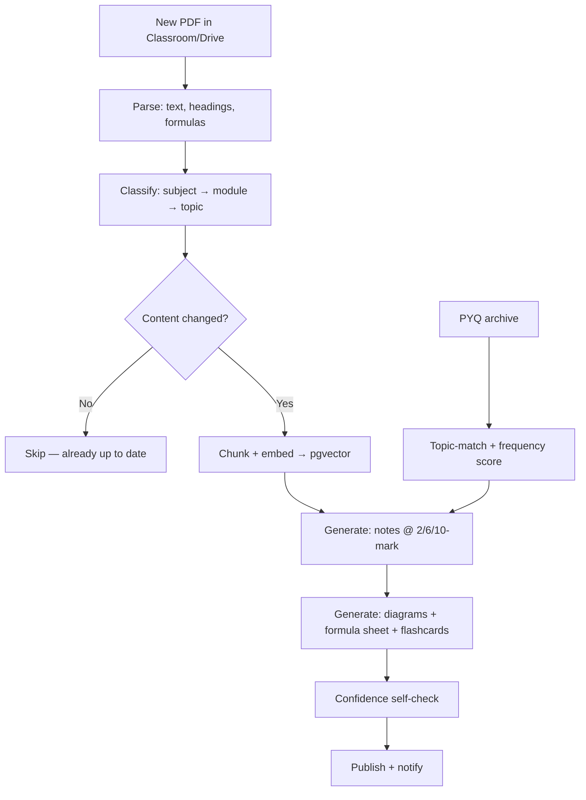
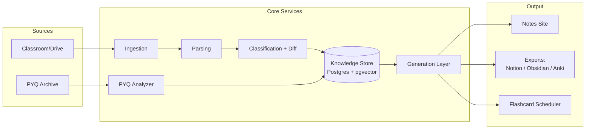
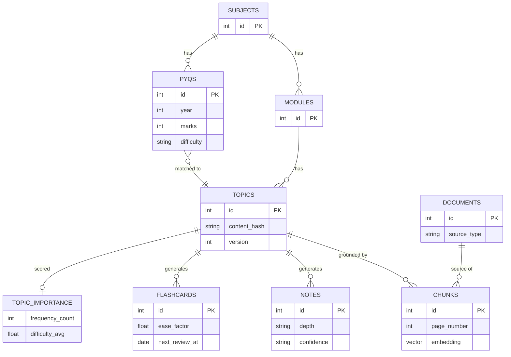

# Tattva 🪷

**Your syllabus, always up to date.**

Tattva watches your Google Classroom/Drive, reads every new PDF the moment it lands, and keeps a living, exam-structured notes site current — automatically, incrementally, and with every claim traceable back to the page it came from.

> तत्त्व (*tattva*) — essence. The agent's job is to distill lecture material down to what actually matters for your exam.

---

## Table of Contents

- [Why Tattva](#why-tattva)
- [Core Features](#core-features)
- [How It Works](#how-it-works)
- [Architecture](#architecture)
- [Data Model](#data-model)
- [Tech Stack](#tech-stack)
- [Project Structure](#project-structure)
- [Getting Started](#getting-started)
- [Roadmap](#roadmap)
- [Design Principles](#design-principles)
- [Status](#status)

---

## Why Tattva

Generic AI note-taking tools summarize whatever PDF you hand them, once. Tattva is different in three specific ways:

| | Generic note tools | Tattva |
|---|---|---|
| Trigger | Manual upload | Auto-detects new Classroom/Drive files |
| Updates | Full re-summarize | Diffs content — only changed topics regenerate |
| Grounding | Often paraphrased loosely | Every claim cited to file + page, confidence-scored |
| Exam alignment | Generic summary | 2/6/10-mark depth tiers, PYQ frequency + difficulty weighting |

Full competitive teardown lives in `docs/competitive-analysis.md`.

---

## Core Features

- 📥 **Autonomous ingestion** — watches Drive/Classroom, no manual uploads
- 🔁 **Incremental updates** — content-hash diffing means only what changed gets reprocessed
- 📎 **Grounded, cited notes** — every note traces back to `(file, page)`, with a `grounded / partial / needs_review` badge
- 🎯 **Exam-depth tiers** — auto-generates 2-mark, 6-mark, and 10-mark versions of every topic
- 📊 **PYQ intelligence** — frequency + difficulty scoring from your own college's past papers, not a generic exam bank
- 🧠 **Spaced-repetition flashcards** — SM-2 scheduling per topic
- 🗺️ **Mermaid diagrams** — auto-generated from notes, not hallucinated freehand
- 📤 **Exports** — Markdown, Notion, Obsidian, Anki CSV
- 💬 **Doubt-solver** — answers only from your own material, Socratic follow-up when useful

---

## How It Works



Only step D→E→F→G→H runs on a **changed topic** — not the whole subject, not the whole syllabus. This is the difference between a demo and something that survives a real semester.

---

## Architecture



Five real services, not nine agents: **Ingestion, Parsing, Classification+Diff, Knowledge Store, Generation.** PYQ Analyzer is a sixth — simple, mostly deterministic, kept separate because it's a different data source.

---

## Data Model



Full schema with SQL: `docs/master-spec.md`.

---

## Tech Stack

| Layer | Choice |
|---|---|
| Frontend | Next.js, Tailwind, shadcn/ui |
| Backend | FastAPI (Python) |
| Database | PostgreSQL + pgvector |
| Scheduler | APScheduler (MVP) → Celery + Redis (scale) |
| Parsing | PyMuPDF, pdfplumber, Tesseract (OCR fallback only) |
| LLM | Gemini API (generation) + lighter model (classification/matching) |
| Diagrams | Mermaid (primary), SVG (fallback) |
| Auth/Ingestion | Google OAuth2 + Drive API (push notifications) |

---

## Project Structure

```
tattva/
├── backend/
│   ├── ingestion/        # Drive/Classroom watchers
│   ├── parsing/          # PDF → text/headings/formulas
│   ├── classification/   # subject/module/topic + diff logic
│   ├── generation/        # note/diagram/flashcard/PYQ prompts
│   └── db/               # schema, migrations
├── frontend/
│   └── ...               # Next.js notes site
├── docs/
│   ├── master-spec.md            # full architecture + prompts
│   └── competitive-analysis.md   # vs NotebookLM/PYQ tools/note apps
└── README.md
```

---

## Getting Started

```bash
git clone <repo-url>
cd tattva
docker-compose up -d          # Postgres + pgvector
cp .env.example .env          # add Gemini API key, Google OAuth creds
cd backend && pip install -r requirements.txt --break-system-packages
uvicorn main:app --reload
```

Phase 1 works with **zero Classroom setup** — drop a PDF via `POST /ingest` and the core loop (parse → classify → generate → cite) runs standalone. Wire up Drive/Classroom OAuth only once that loop is solid.

---

## Roadmap

- [x] Spec + architecture finalized
- [ ] **Phase 1** — Core loop: manual PDF → grounded, cited, depth-tiered notes
- [ ] **Phase 2** — Live ingestion, incremental diffing, flashcards, exports
- [ ] **Phase 3** — PYQ analyzer, difficulty tagging, mock-paper generator, coverage tracker
- [ ] **Phase 4** — Diagrams inline, guided doubt-solver, audio overviews

Full prompt-by-prompt build sequence for each phase: `docs/master-spec.md`.

---

## Design Principles

1. **Ground everything.** No note ships without a citation; anything unsupported is flagged, not hidden.
2. **Diff, don't regenerate.** Cost and correctness both depend on only touching what changed.
3. **Deterministic where possible.** Frequency counts and diffs are SQL, not LLM guesses — the model is used only where judgment is actually needed.
4. **Scope to your syllabus.** Not a generic exam-prep platform — built around one student's actual modules and actual PYQ archive.

---

## Status

Active spec, pre-implementation. :)
